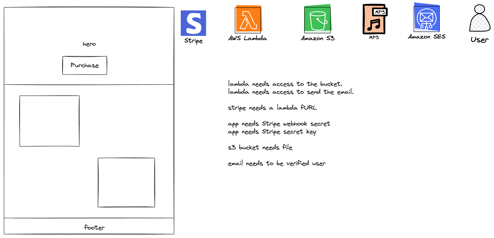
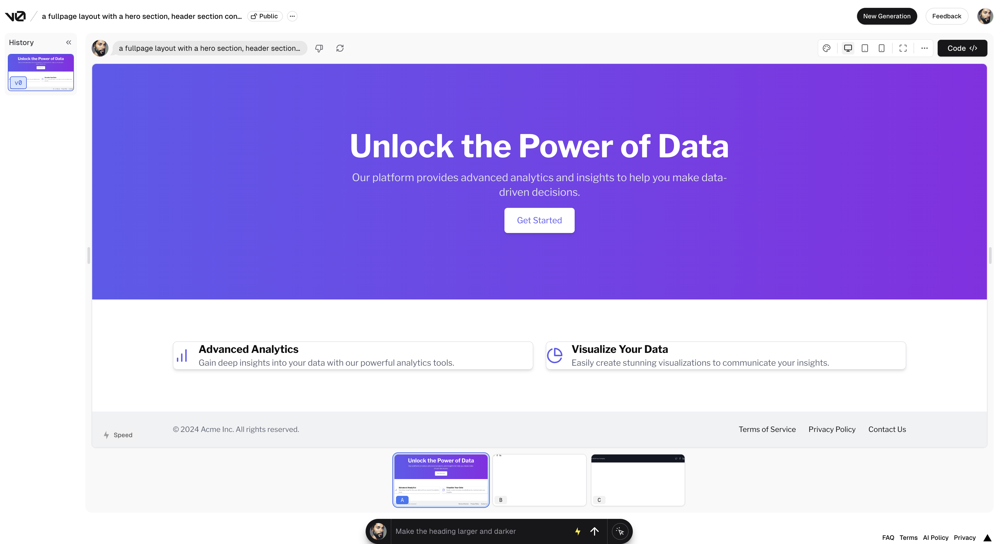

# AWS Amplify Simple Checkout (Gen2)



Alright, the idea here is that I can use Amplify's new Gen2 experience to build out an app where someone can download digital goods.

## UI Development

I'm dedicating 2 hours to this. So to get this done quickly, I'm going to use v0 to just create my UI.

My prompt: "a fullpage layout with a hero section, header section containing 2 cards with details, and a footer."



I made a few UI tweaks, but leave it for the most part. Additionally, I create a Stripe payment link in the Stripe dashboard.

UI is done.

## Backend Initialization

This shouldn't be too hard (famous last words😅) But I've done most of this before.

I'll start by logging into my AWS profile

```sh
aws sso login --profile focus-otter-youtube
```

Once done, I'll initialize Amplify and start the sandbox

```sh
npm create amplify@latest && npx ampx amplify sandbox
```

### Creating my services

I'll start with creating the Lambda function and the S3 bucket.

Using [this docs page](https://docs.amplify.aws/nextjs/build-a-backend/functions/set-up-function/) as a reference, I create a folder called "stripe-checkout" for my `resource.ts` file.

For my S3 I do the same by following [this docs page](https://docs.amplify.aws/nextjs/build-a-backend/storage/set-up-storage/)

> Not that it's tough when using the CDK, but I'm still amazed at how easy that is.

I then bring those resources into my backend.ts file:

```ts
import { defineBackend } from '@aws-amplify/backend'
import { storage } from './storage/resource'
import { stripeCheckoutSongFunc } from './functions/stripe-checkout/resource'

/**
 * @see https://docs.amplify.aws/react/build-a-backend/ to add storage, functions, and more
 */
const backend = defineBackend({
	stripeCheckoutSongFunc,
	storage,
})
```

### Creating a Function URL for Stripe

Stripe needs a webhook. So I'm going to give my Lambda function a fURL and add it to my outputs file:

```ts
const stripeWebhookUrlObj =
	backend.stripeCheckoutSongFunc.resources.lambda.addFunctionUrl({
		authType: FunctionUrlAuthType.NONE,
	})

backend.addOutput({
	custom: {
		stripeCheckoutSongFunc: stripeWebhookUrlObj.url,
	},
})
```

Being able to drop to the native L2 construct is super nice!

### Allow my function to sendEmails

I want to email the song from S3 to the user. I know how to set the permissions, but I forget what permissions I need. I know that SES has a v2 of their API, so I'll have to look into that.
[Found it](https://docs.aws.amazon.com/AWSJavaScriptSDK/v3/latest/client/sesv2/command/SendEmailCommand/)

Ugh. I remember why I didn't like this. I have to set all the raw headers myself. I know I have a repo for this. Once sec.

[Found it](https://blog.focusotter.com/create-a-resume-uploader-using-aws-amplify#adding-a-lambda-function)

I end up adding the following policy:

```ts
backend.stripeCheckoutSongFunc.resources.lambda.addToRolePolicy(
	new PolicyStatement({
		actions: ['ses:SendEmail', 'ses:SendRawEmail'],
		resources: ['*'],
	})
)
```

### Assigning S3 Permissions

My function needs the ability to get the song from S3. With gen2 that experience is more streamlined and flexible. In fact [this page](https://docs.amplify.aws/nextjs/build-a-backend/storage/authorization/) shows me how to do it.

I add the following:

```ts
import { defineStorage } from '@aws-amplify/backend'
import { stripeCheckoutSongFunc } from '../functions/stripe-checkout/resource'

export const storage = defineStorage({
	name: 'amplifyStripeSongCheckout',
	access: (allow) => ({
		'products/*': [allow.resource(stripeCheckoutSongFunc).to(['read'])],
	}),
})
```

Crazy that I've done all of this and still haven't deployed anything 😅 But all good things must come to an end. At this point, I can deploy and start adding my business logic.

## Sandbox Deployment

To get the initial deployment going, I run the following command:

```sh
npx ampx sandbox --profile focus-otter-youtube
```

hmm. I get the following error:

```txt
Failed to instantiate nodejs function construct
Caused By: Cannot find entry file at /Users/focusotter/Projects/gen2-content/simple-stripe-checkout/amplify/functions/stripe-checkout/handler.ts
```

oh, duh. It'd be nice if I added a ./main.ts file lol.
I create the file

```ts
export const handler = async (event: any) => {
	return 'Hello, World!'
}
```

It broke because the function construct has the `entry` as `./handler` but my file is called `./main.ts`. I make the change and the deployment is now kicking off.

The deployment is successful and I see the function url in the `amplify_outputs.json` file.

> I'm just now realizing that my frontend and backend are architecturally disconnected. I'll never configure Amplify to run on the frontend.

## Provisioning Stripe and my Secret

Alright, this is the part I need to get right.
Adding the fURL to Stripe as a webhook is no problem, but I need to see how to secrets correctly.

I add the secret and get my webhook signature

Alright, so locally, I'm going to set my secret:

```sh
npx ampx sandbox secret set stripe-webhook --profile focus-otter-youtube
```

From there I paste in my secret called "stripe-webhook". I wish there was more feedback from the terminal that the secret was successful.

I do the same for my stripe secret key and call it "stripe-secret".

Since there is no feedback, I check in the AWS console to make sure they are their and with the correct values. They are 🙂

I haven't seen anywhere in the docs where I need to manually set the permissions so I'm going to assume that Amplify is going to take care of that for me.

## Adding a File to the Bucket

Nothing fancy here. I'm going to create an mp3 from Suno.com and store the mp3 in my S3 bucket. Looking at my `amplify/storage/resource.ts` file, it looks like it has to be under the `products` folder.

The prompts: A.W.S. Amplify just launched gen2. This uses typescript so that developers have a streamlined way of building out fullstack applications.

The song: https://suno.com/song/b32f1773-c969-4194-9200-3388cc4573c1

I stored it in the `products` directory as `amplify-song.mp3`.

## Lambda Business Logic

Alright, everything has been pretty easy so far! Now time to write the code to do all of this.

I think I'll trying the following approach:

1. Add in the code to verify the webhook and run a function when the `checkout.session.completed` type is sent.
2. Get the mp3 from S3.
3. Configure nodemailer with SES. Send a simple email.
4. Put it all together by sending the email with an attachment.

### Verify a Stripe Webhook

This part shouldn't be too tough since this is my second time doing it and the first time was without the Amplify utilities.

I create an `amplify/functions/stripe-checkout/helpers` directory and add a `verifyStripeWebhook.ts` file. In the root of my application, I install the `stripe` package.

```sh
npm i stripe
```

Using [this doc page](https://docs.amplify.aws/nextjs/build-a-backend/functions/environment-variables-and-secrets/#secrets) as reference, I pass in the secret as an envVar:

```ts
export const stripeCheckoutSongFunc = defineFunction({
	name: 'stripe-checkout-song',
	entry: './main.ts',
	environment: {
		STRIPE_SECRET: secret('stripe-secret'),
		STRIPE_WEBHOOK_SECRET: secret('stripe-webhook'),
	},
})
```

Now, in my `verifyStripeWebhook` file, I import the env:

```ts
import { env } from '$amplify/env/stripe-checkout-song'
```

Wait...this is the entire file 😮

```ts
import Stripe from 'stripe'
import { env } from '$amplify/env/stripe-checkout-song'

type Event = {
	headers: {
		'stripe-signature': string
	}
	body: string
}
export const verifyWebhookSig = async (event: Event) => {
	const stripe = new Stripe(env.STRIPE_SECRET)
	const sig = event.headers['stripe-signature']

	try {
		const stripeEvent = stripe.webhooks.constructEvent(
			event.body,
			sig,
			env.STRIPE_WEBHOOK_SECRET
		)
		return stripeEvent
	} catch (err) {
		console.log('uh oh', err)
		throw Error('Invalid signature')
	}
}
```

I don't need a separate `getSecretParameter.ts` file like I usually do.

With that in place, I update my function's `main.ts` file:

```ts
import { verifyWebhookSig } from './helpers/verifyStripeWebhook'

const mainFlow = async () => {
	console.log('in here')
}

export const handler = async (event: any) => {
	const stripeEvent = await verifyWebhookSig(event)
	switch (stripeEvent.type) {
		case 'checkout.session.completed':
			await mainFlow()
	}
	return 'Hello, World!'
}
```

Time to test out this first part.

In the AWS console for Lambda, I verify that all the SSM, SES, S3, and CloudWatch permissions are there.

I use my UI to checkout. I think the Lambda will either timeout, or be out of memory.

You gotta be kidding me. This worked the very first time. I've never had this happen before.

### Get the file from S3

This is another part that I've done before. Never with a song though.

As before, I'll create a helper file called `getSongFromS3.ts`

Strip away the error handling and this is the important part:

```ts
res = await s3Client.send(
	new GetObjectCommand({ Bucket: bucketName, Key: imgKey })
)
```

So it looks like I better update my function to take in the bucketName and songKey. Wait a sec...

Yea--I knew it. So my function needs the s3 bucketname, but I can't use `backend.storage...` because it will create a circular reference (Amplify throws an error saying it can't be accessed before initialization).

But I can use `env.AMPLIFY_STRIPE_SONG_CHECKOUT_BUCKET_NAME`. Amplify created this on my behalf. Nice!

I need to also add my song key as an envVar. I create a .env.local file in the root of my project and add the following:

```sh
PRODUCT_KEY="products/amplify-song.mp3"
```

hmmm...all my secrets are gone after adding to my Lambda function `environment` section.

I go through an uncomment all references to `{env}` in my app. This is frustrating.

10 minutes in and I narrow it down: If I use `process.env` then it blows away all the env vars in `.amplify/generated/env/function-name.ts` in place of a single `export const env = process.env as any;`

I report this to the team.

I hard code the value in my Lambda:

```ts
export const stripeCheckoutSongFunc = defineFunction({
	name: 'stripe-checkout-song',
	entry: './main.ts',
	environment: {
		STRIPE_SECRET: secret('stripe-secret'),
		STRIPE_WEBHOOK_SECRET: secret('stripe-webhook'),
		SONG_KEY: 'products/amplify-song.mp3',
	},
})
```

hmm..turns out accessing `env.` will pull up my `SONG_KEY` variable. Still. Not sure how I can use `.env.local` variables on my frontend without blowing up my backend.

In any case, I have the code to get the file and I'm ready to test this out.

It works first try :)

### Sending the Song via Email

Initially, I was going to use nodemailer, but I want to try something.

Writing the language raw language for SES is tough. I don't have much faith in chatGPT, but I wonder how Claude will do.

prompt: "Using a nodejs lambda function with v3 of the aws-sdk, how can I get a file from s3 and send it as an attachment using ses?"

I followed up with: "rewrite this assuming that the file from s3 is an mp3 file."

Then I added: "for the ses client, use SESv2Client."

It gave me some S3 code, so I'm going to copy/paste the result from Bedrock (Claude Sonnet)
.
.
.
It took a little massaging due to TS checking, but pretty seamless!

To make things a little more flexible, I pass my email in as the FROM_EMAIL_ADDRESS as an envVar to my Lambda and pass a the customer email to my main function:

```ts
switch (stripeEvent.type) {
	case 'checkout.session.completed':
		await mainFlow(stripeEvent.data.object.customer_details?.email)
}
```

```ts
const mainFlow = async (customerEmail: string | null | undefined) => {
	if (!customerEmail) throw new Error('Stripe customer email not found')
	//rest of code...
```

    At this point, I'm ready to start this off. I'll checkout and see what happens.

    oh wait 😅 I should probably verify my email in ses first!

Past me was awesome and put the AWS CLI command to verify an email address:

```sh
aws ses verify-email-identity --email-address your-email@email.com --region us-east-1 --profile=your-aws-profile
```

Just so future me can use the AWS console 😅.

I ended up verifying mtliendo@gmail.com and mtliendo@focusotter.com since I forget which one is going to be used by Stripe.

Alright the moment of truth. I checkout, and...

Cloudwatch says it made it to the SES flow, but stopped at `"can not read proptery of undefined."`

I don't know how to troubleshoot this. I'm going to make sure I didn't miss anything in a previous repo...

Ah ha! when getting a font from S3 I have these two lines:

```ts
const fontByteArr = await fontRes.Body.transformToByteArray()
const fontBuffer = Buffer.from(fontByteArr)
```

But in my app, I only have the first line. Gonna fix that and try again.

This is already a good sign because I didn't have to do any weird casting.

Still the same error. Since I don't know what the issue is and I don't know how to debug, AND I have a workign code sample with nodemailer, I'm going to use that instead.

```sh
npm i nodemailer
```

Ugh...nodemailer isn't compatible with v2 of SES. ctrl+z until I get back to where I was.

I knew this was going to be the toughest part. No worries. I got this!

Alright. I spent some time looking at the docs, and I feel like I'm close. I'm reading over the documentation for it [here](https://docs.aws.amazon.com/AWSJavaScriptSDK/v3/latest/Package/-aws-sdk-client-sesv2/Interface/SendEmailCommandInput/). The one thing I notice is that data has to be an buffer.

I tweak my code to the following:

```ts
const sendEmailParams = {
	FromEmailAddress: myEmail,
	Destination: {
		ToAddresses: [toEmailAddress],
	},
	Content: {
		Raw: {
			Data: Buffer.from(rawMessage),
		},
	},
}
```

It works! Well...the message was successfully sent. But I didn't get an email?

Cloudwatch shows a successful message ID. My function used 148MB of 512 and went for 1221 ms of 3000ms.

OMG, I checked the wrong spam folder. It's there!!!

## Conclusion

So I slotted two hours to this, but it took 4. I mean..not bad!

There were some quirks with envVars that are being captured [here](https://github.com/aws-amplify/amplify-backend/issues/1460), but I was flying in the beginning! Sending raw emails is tough for anyone so the fact that took an hour of my time isn't a fault of Amplify, though I wish they had a wrapper around it.

Because sending an email was by far the hardest part, I spent some time parameterizing it. The end result is definitely something reusable!
